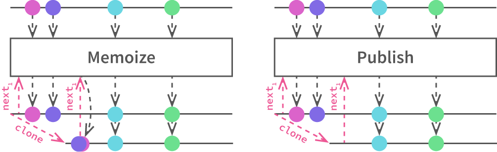
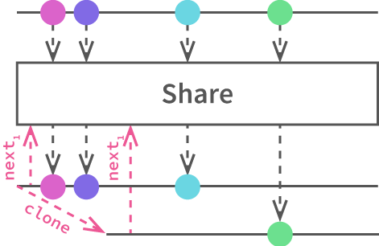

## HHReactor &mdash; _almost_ InteractiveX streams for strict Hack

```
$ composer require hhreact/hhreactor
```

### Getting started

#### The what

If you know what **InteractiveX** is, HHReactor matches the InteractiveX philosophy closely, really only [straying significantly for the binding operators](#operators).

If, alternatively, you know what **ReactiveX** is, InteractiveX is the "pull" analogue, where enumerables take the place of observables.

If you know what [`AsyncGenerator`](https://docs.hhvm.com/hack/async/generators#sending-and-raising) and [`AsyncIterator`](https://docs.hhvm.com/hack/async/generators#async-iterators) are, HHReactor lets you clone, reduce and expand async generators, and lets you enforce precise policies on buffering.

#### In action

```hack
<?hh
// Producer and connection_factory contain most of the functionality
use HHReactor\Producer; // *
use function HHReactor\HTTP\connection_factory; // **
use HHReactor\WebSocket\RFC6455;

\HH\Asio\join(async {

	///////////////
	// * BASIC * //
	///////////////
	
	// Start with any AsyncIterator
	$iter_numbers = async {
		for($i = 0; ; $i++) {
			yield $i;
			await \HH\Asio\later();
		}
	};

	// Now make it really P R O D U C E
	$number_producer = Producer::create($iter_numbers);

	// Transform a stream, e.g. map
	$square_producer = (clone $number_producer)->map(async ($root) ==> pow($root, 2));
	// Transform two streams into one, e.g. zip
	$cube_producer = Producer::zip($number_producer, $square_producer, ($root, $square) ==> $root * $square);
	// Transform many streams into one, e.g. merge
	foreach(Producer::merge(Vector{ $number_producer, $square_producer, $cube_producer }) await as $some_number) {
		// numbers flying at your face! Beware: no guaranteed order with `merge`
	}

	// Note that Producer wraps transparently:
	foreach(clone $producer await as $item) { /* same items as $iter_numbers */ }
	
	////////////////
	// ** HTTP ** //
	////////////////
	
	// Merge stream of requests from ports 80 and 8080
	$http_firehose = Producer::merge(Vector{ connection_factory(80), new connection_factory(8080) });
	
	// To cancel/dispose, just use what the language gives you: `break`, `return` and `throw`;
	//  the iterating scope is in full control.
	foreach(clone $http_firehose await as $connection) {
		await $connection->write('No, _you_ deal with this');
		break; // great for if you don't like commitment
		
		// The "Details of Producer" section further down explains what
		//  happens when you cancel a Producer partway
	}
	
	// If you're up for it, do something more interesting than quitting immediately
	foreach(clone $http_firehose await as $maybe_connection) {
		try {
			// try to parse headers; fail if client fails to send them all
			$connection = await $maybe_connection;
			
			$request = $connection->get_request();
			if($request->getHeader('Upgrade') === 'websocket') {
				$handler = $websocket_router->route($request->getUri());
				
				// wrap the connection object in a `WebSocketConnection` to
				//  handle handshake and websocket frames
				$handler(new RFC6455($connection))
			}
			else {
				// non-websocket requests
				$handler = $router->route($request->getMethod(), $request->getUri());
				$handler($connection); // stream the rest of the body (if there is one)
			}
		}
		catch(\Exception $e) {
			
		}
	}
	
	// In general, don't try iterate the original AsyncGenerator:
	//  you'll probably get a "Generator already started" exception
});
```

#### The context (the sales pitch)

Trying to bring ReactiveX thinking into Hack using its native [async-await](https://docs.hhvm.com/hack/async/introduction) and [asynchronous generators](https://docs.hhvm.com/hack/async/generators) proves unnatural because they advertise opposite control schemes: await-async gives control to the consuming scope to manage iteration, whereas ReactiveX employs callbacks to give the `Observable` the control over iteration. ReactiveX actually has a more obscure dual known as InteractiveX that replaces `IObservable` with `IEnumerable` and far better describes a Reactive approach in an async-await scheme. Bart De Smet gives [a cogent (and, judging by the lack of competition, authoritative) 55-minute presentation on InteractiveX considerations](https://channel9.msdn.com/Shows/Going+Deep/Bart-De-Smet-Interactive-Extensions-Ix), especially buffering in the final 15.

Hack's async generators sound very promising out of the box for streaming usages since no setup is required: HHVM has a built-in, hidden scheduler. However, the generators they are limited in their simplicity; `foreach-await` is almost their only advertised use case. So, a wrapper over many streams can really only `concat` these streams, by successively iterating them in serial.

With careful use of `ConditionWaitHandle`s, HHReactor's `Producer` is able to parallelize, expand and reduce streams, and so brings the rich suite of InteractiveX operators to Hack's async iterators. `Producer` is also designed to be minimally-intrusive: it fits the `AsyncIterator` signature down to a `+T` (emphasis on the covariance), it matches the behavior of the underlying iterators and it is almost stateless if no operators or cloning are applied.

### <span style="color:#F00">\*</span> Compatibility with HHVM >3.23

The maintainers of Hack have moved to [remove destructors from strict Hack entirely in coming releases](https://hhvm.com/blog/2017/11/17/hhvm-3-23.html) sometime in HHVM >3.23. HHReactor relies on eager refcounting and defines a custom destructor on BaseProducer for timing to work properly. Without a guarantee that the destructor will be called _at all_, Producer is bound to leak when it's paused, which is a critical, if not application-breaking bug.

Hence, **I do not recommend running the current version (~1.0) of HHReactor on HHVM >3.23**. This will be a tough patch if it is even worth it, and the solution will probably involve manual disposal, which is much dirtier than the automatic disposal in place for HHVM <3.23.

### HHReactor: what's in the box

- **`BaseProducer`**: manages cloning and accounting on running clones
- **`Producer extends BaseProducer`**: InteractiveX operators and support for [arbitrary scheduling and higher-order iterators](#constructor). The &#x2B50; of the show
- **`connection_factory`**: listens on a TCP stream for HTTP requests, parses headers, and produces streams of the request bodies
- **`Connection extends BaseProducer`**: Streams bodies from HTTP requests, and sends responses to clients

### <a name="operators"></a>Operators

Most of the operators match the canonical InteractiveX/ReactiveX signatures. The quickest way to scan the signatures is to [look at the reference documentation](#ref-doc).

Major discrepancies:

1. **"Binding" operators &ndash; `share`, `memoize`, `publish`**: [these are replaced by cloning](#dynamics).
2. [**`debounce` operator**](https://github.com/acrylic-origami/HHReactor/issues/1): not yet implemented due to technical challenges, but high on the priority list.
3. **`defer` operator**: no strong motivation to implement it.
4. **`never` operator**: non-terminating, lazy `Awaitable`s and `AsyncIterator`s are impossible in Hack (right now anyways; 2017-06-17)
5. **Order preservation where natural**, e.g. in `map`, `reduce`, and `filter`. The Hack spec doesn't protect against extremely pathological race conditions, where the _single_ arc from an iterator yielding into a `Producer`'s buffer is overtaken by the cascade of arcs to restart the iterator from another scope, obtain the next value then put it in the shared buffer. As of HHVM 3.19, it doesn't look like the actual async implementation allows this, but without specification, order preservation sadly can't be guaranteed.

### <a name="dynamics"></a> Dynamics of `Producer`

If two or more scopes consume the same stream, they can either clone or not clone the `Producer`:

1. **[Ix's Memoize &amp; Publish] If the `Producer` is cloned**, the buffer is also cloned, so consumers will receive the same elements from the moment of cloning. In this way, clones act like InteractiveX's `Memoize` and ReactiveX's [`Replay`](http://reactivex.io/documentation/operators/replay.html).

  

  To emphasize: the clone doesn't see any elements produced by that `Producer` before the clone exists. In this way, `Memoize` and `Publish` behavior differ only in when/of what the consumer takes a clone. Cloning from a `Producer` that is never iterated will give `Memoize` behavior. Cloning moving `Producer`s will give `Publish` behavior.
  
  Note however that, because the consumer is in control of iteration, the underlying iterators aren't started until the first clone requests the first element.

  > **Behavioral Note**: as [will be mentioned below too](#buffering), the buffer is managed like `Publish` rather than `Memoize`. `Producer` is very straightforward with deciding which nodes are reclaimed because it relies on the garbage collector: once the laggiest consumer advances, the node is reclaimed. It is then a simple and explicit matter of keeping or not keeping unstarted `Producer`s, which will or won't hold elements from the very beginning respectively.
2. **[Ix's Share] If the `Producer` is not cloned**, consumers all share the same buffer, and hence they compete directly for values.

  

> **Behavioral note**: All operators implicitly clone their operands to avoid competing with other operators or raw consumers for values; they all implicitly `Publish`.

### <a name="httpserver"></a> HTTP Server

#### 1. `connection_factory`

`connection_factory` starts an HTTP server when called, accepts connections through a TCP socket. It accepts each connection and offloads the work to a separate async function to parse the headers, hence it produces an `Awaitable` that will fail if the headers are incomplete when the stream closes. 

#### 2. `Connection`

Proper headers will result in a `Connection` object which, as an async iterator, streams the body of the request, and also provides an async `write` method to respond to the client.

#### <a name="websocket"></a> `WebSocketConnection`

When a WebSocket request is identified, the `Connection` object for that `Request` can be used to construct a (most likely) `RFC6455` object which subclasses `WebScoketConnection`. It handles the handshake, parses frames and produces strings from the client and and breaks out an asynchronous `write_frames` method to send string frames back to the client.

### <a name="ref-doc"></a>Reference Documentation

[hphpdoc](https://github.com/appertly/hphpdoc) makes reference documentation really easy to compile as needed:

```bash
$ mkdir doc
$ ./vendor/appertly/hphpdoc/bin/hphpdoc -o doc -- src
$ # View in browser at ./doc/index.html
```

---

### Details of `Producer`

#### <a name="buffering"></a> Details of buffering

The producing and consuming timelines are separated by a buffer and a notifying signal that tells the consumer there is at least one item in the queue. It works like a kitchen at a diner: the items are produced and queued, then a "bell" is rung to signal the worker to serve the items at their earliest convenience to the consumer.

The signalling is so weak because timing and ordering rules in the Hack scheduler are correspondingly weak. Notably, if many `await` statements are queued in parallel and are ready to be resumed simultaneously, the Hack scheduler makes no guarantees about the order they'll be processed. `Producer`s `await` various iterators they hold, and the consumer `await`s the `Producer`; these are queued in parallel, which is subject to the weakness of the ordering rules. To implement `Producer` without a buffer, we would have to guarantee the consumer gets control right after any iterator under that `Producer` yields, which is unreliable in general.

`Producer` relies on the garbage collector to clear the buffer it accumulates from differences in consumption rates between consumers. As the laggiest consumers step their way through the buffer, their references to the earliest nodes of the buffer linked list are shed and the garbage collector clears these unreachable nodes.

While this is subject to change, [the way PHP works forces HHVM somewhat to adopt eager refcounting](http://hhvm.com/blog/431/on-garbage-collection), which helps clear the spent nodes faster.

#### <a name="constructor"></a>Arbitrary scheduling and higher-order iterators

```hack
/* Condensed signature */
Producer<T>::__construct(Vector<(function((function(AsyncIterator<T>): void)): AsyncIterator<T>)> $generators)

/* Expanded signature */
Producer<T>::__construct(
	Vector< /* many-to-one */
		(function( /* factories of AsyncIterators */
			(function(AsyncIterator<T>): void) /* that can append new ones at any time */
		): AsyncIterator<T>)
	> $generators
)
```

`Producer::create` is the starting point for most cases to apply operators to an `AsyncGenerator`. However, `Producer::create` is just a special case of the constructor, which allows the generating functions to merge iterators they create into the output stream at any point by calling an "appending" function that is passed to it. This is useful behavior in general, because it means **async code can manufacture more async code and run it without blocking itself**.

> **Friendly note:** the appending is signalled weakly through the same bell the values use, so iterators are not necessarily iterated immediately.

`flat_map` uses this behavior the most directly &mdash; the main body of the operator must iterate the `Producer` in parallel with iterating the `AsyncIterator`s that are coming off of it as they arrive. [That parallelization is accomplished with the appending function](https://github.com/acrylic-origami/HHReactor/blob/1c9302cfe3574780a2e1531674998fa70bd26083/src/Producer.php#L360).

Without using the appender, the constructor for the `Producer` will merge the value streams from the generating functions into a common output. `merge` is implemented [exactly that way](https://github.com/acrylic-origami/HHReactor/blob/1c9302cfe3574780a2e1531674998fa70bd26083/src/Producer.php#L647) in fact!

> **Friendly note:** For higher-order `Producer`s like `Producer<Producer<T>>`, outer `Producer`s **will not** automatically clone the inner `Producer`s as they're yielded. This is less restrictive but could be surprising: clones of the outer producer will produce identical inner `Producer`s which will be **`Share`d**, so their consumers will compete for values, even though the outer producer is cold.

#### Running, pausing and exiting early

**The how**

You can stop consuming from a `Producer` in a few ways, each with different consequences for resources.

1. _Just drop all references to it_, and free resources as quickly as possible. This includes all clones and all `Producer`s that come from operations on the `Producer` of interest.
2. _Drop only the running instances/clones_, and stop consuming resources quickly, but maybe restart later.
3. To free resources quickly, but maybe restart later:

```php
// given:
$producer = Producer::create($async_generator);

//...

$iterator_edge = $producer->get_iterator_edge(); // Awaitable<void>
$producer = null; // drop the references like they're hot
await $iterator_edge; // wait for $async_generator `next` to become available

// ...

foreach($async_generator await as $v) { /* begin iterating it again */ }
```

**The why**

When disposing of `Producer`s, there are two determining factors to the iterators and buffers in their ecosystem after they become unreachable:

1. Has `next` ever been called on it, its clones, or `Producer`s coming from its operators?
2. What do they wrap? 
	- Other `Producer`s (e.g. are they results of operators on other `Producer`s)?
	- `AsyncGenerator`s?
	- (Notably, what happens to an opened TCP stream?)

`Producer` is designed with pausing in mind, to meet the need to arbitrarily stop buffering values but keep resources open to resume later. Some informative aspects of the process:

1. When the first item is requested from a `Producer`, it begins "running".
2. Each `Producer` knows the number of running clones.
3. `detach`ing a running `Producer` decrements the running count.
4. When the running count drops back to 0, the `Producer`:
	1. Stops running its children (which stops the buffer from growing) and
	2. "detaches" from its child `Producer`s by decrementing their running refcounts.\*

See 1. `Producer::_attach`; 2. `BaseProducer::running_count`, `BaseProducer::this_running`, `BaseProducer::some_running`; 3. `Producer::__destruct`; 4.1. `Producer::awaitify`; 4.2. `Producer::detach`.

<sup>\*A `Producer` knows it holds running references to all of its children because, as part of its attachment routine, `Producer` must start iterating them all.</sup>

A `connection_factory` iterator wrapped by a `Producer` would stop _buffering_, but **it wouldn't close the TCP socket** until its _refcount_ drops to 0, so the system queue for that socket might begin to fill instead. Again, HHReactor leans on the garbage collector to close these sockets, and only when _all_ references to the `connection_factory` iterator are dropped (not just running ones).
